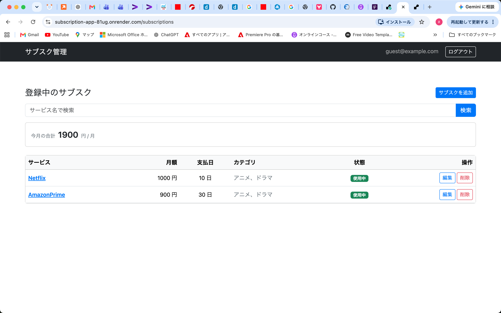
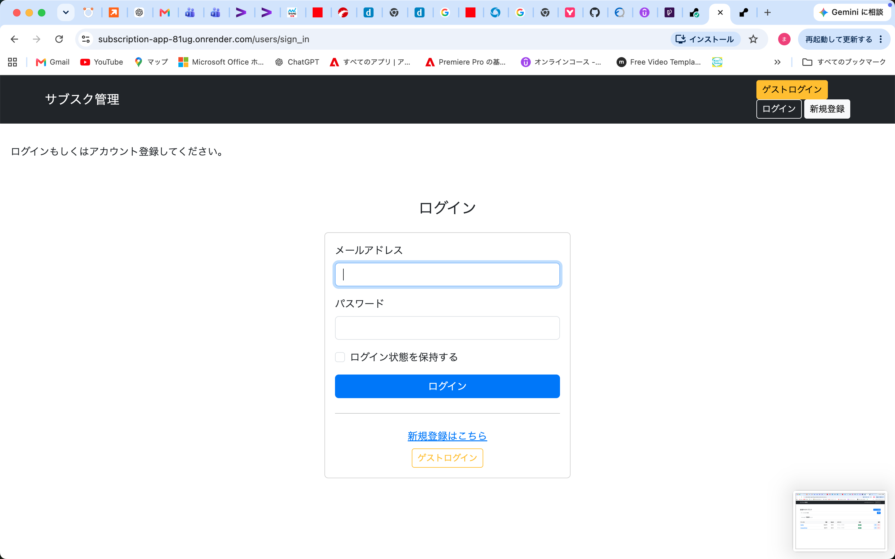
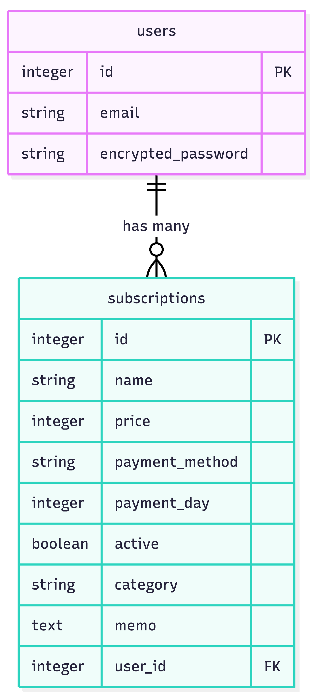

# サブスク管理アプリ（Subscription Manager）

契約中のサブスクを一覧で管理し、月の合計金額を可視化するWebアプリです。
「何に・毎月いくら払っているか」を把握し、使っていないサブスクに気づけるようにします。

## 公開URL

https://subscription-app-81ug.onrender.com

「ゲストログイン」ボタンから、登録不要ですぐにお試しいただけます。
（無料プランのため、初回アクセス時は起動に30秒ほどかかる場合があります）

## スクリーンショット

### 一覧画面（ゲストログイン）


### ログイン画面



## なぜ作ったか（開発動機）

もともと一つひとつは数百円の小さなサブスクにいくつも加入していましたが、
積み重なると月にかなりの額になっていました。
しかも、その中には使っていないサービスもあり、把握できていませんでした。
そこで、契約中のサブスクを一覧で管理し、月の合計金額が一目で分かるアプリを作りました。
　

## 主な機能

- ユーザー登録・ログイン・ログアウト（devise）
- ゲストログイン（登録不要でワンクリックログイン）
- サブスクの登録・一覧・詳細・編集・削除（CRUD）
- 月額の合計金額を自動計算
- サービス名でのあいまい検索
- ログインユーザーごとに自分のサブスクだけを表示
- 入力値のバリデーション（必須・金額・支払日の範囲チェック）

## 使用技術

- Ruby 3.4.5
- Ruby on Rails 7.2.2.1
- SQLite（開発環境）
- Bootstrap 5（CDN）
- devise（認証）
- Git / GitHub

## ER図



users（1）── has many ──（多）subscriptions
1人のユーザーが複数のサブスクを持ち、subscriptions の user_id で紐付けています。

## 工夫した点

- **セキュリティ**：Strong Parameters で許可したカラムのみ保存し、
  検索ではプレースホルダ（`?`）を用いてSQLインジェクションを防いでいます。
- **データの分離**：`current_user` を使い、ログイン中のユーザー自身の
  サブスクだけを表示するようにしています。
- **ゲストログイン**：採用担当者が登録不要で中を確認できるよう実装。
  ゲストのパスワードはランダム生成し、ボタン経由以外でログインできないようにしています。
- **バリデーション**：不正な入力（空欄、0円以下、支払日が1〜31の範囲外など）を弾き、
  エラーメッセージは日本語で表示しています。
　

## 今後実装したいこと

- カテゴリでの絞り込み・重要フラグでの振り分け
- 支払日が近いサブスクの通知
- テストコード（RSpec）の導入
- ロゴ画像のアップロード（Active Storage）


## セットアップ手順

```bash
# リポジトリをクローン
git clone https://github.com/makotookamoto0220-sys/subscription_app.git
cd subscription_app

# gemをインストール
bundle install

# データベースを作成・マイグレーション
rails db:create
rails db:migrate

# サーバーを起動
rails server
```

ブラウザで `http://localhost:3000` にアクセスしてください。